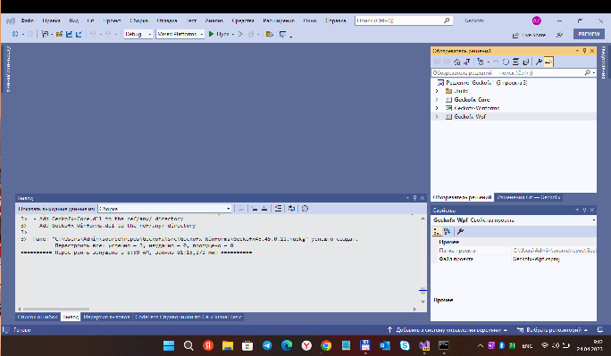

# GeckoFx

GeckoFx45 RnD

## Screenshots


## Building the project
My fork of [Mozilla's "GeckoFX-45" solution](https://github.com/MicrosoftBandDev/companion-app), 
which is still in the preview stages... 

Once you have the development environment set up, you're ready to clone the repo.
```bash
git clone --recursive https://github.com/mediaexplorer74/GeckoFx
```

You need Visual Studio 2022 *Preview* to assemble (build) my solution.

## Status
- only "libraries" (firefox "wrappers") compiled
- no exe, no uwp, etc.

## References
https://github.com/nutellarlz Josiah Horton aka nutellarlz
https://github.com/nutellarlz/geckofx-45.0 Project GeckoFx-45.0

## ..
AS IS. No support. DIY

## .
[m][e] 2023
